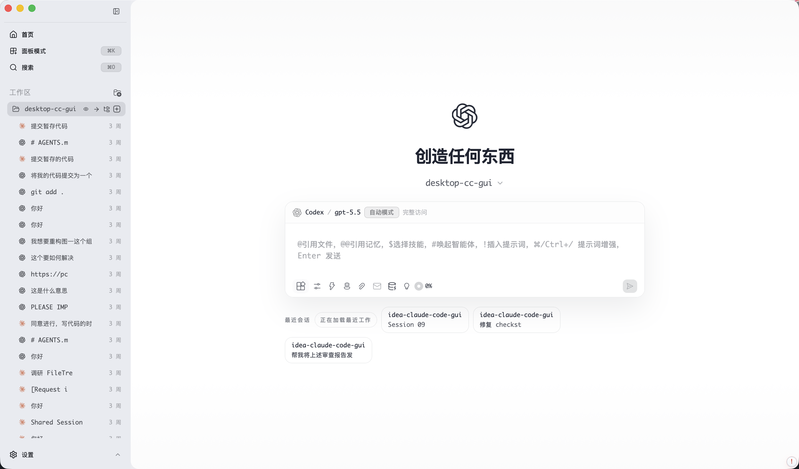

<div align="center">

# CC GUI 客户端


[English](./README.md) · **简体中文**

<a href="https://trendshift.io/repositories/25546" target="_blank"></a>

![][github-contributors-shield] ![][github-forks-shield] ![][github-stars-shield] ![][github-issues-shield]

</div>

**ccgui** 是面向专业开发者的跨平台 AI 工程工作台。它把多引擎编码、项目上下文、任务执行、终端、Git、记忆与治理证据收束到一个透明、local-first 的桌面客户端里。

当前应用基于 **Tauri 2 + React 19 + TypeScript + Vite** 构建，核心目标不是再做一个聊天框，而是让 AI 辅助开发过程可观察、可恢复、可审计。

> 本项目源自 [CodexMonitor](https://github.com/Dimillian/CodexMonitor)，现在已经演进为更完整的多引擎 AI 编程客户端。



---

## 核心能力

### 多引擎 AI 工作台

在同一界面管理多个 AI 编程引擎，并按任务自由切换：

- **Claude Code** — 会话连续性、历史可见性、上下文用量、compact/reasoning 控制与运行时恢复。
- **Codex CLI** — 启动配置、Plan 可视化、协作模式约束、排队 follow-up 与运行诊断。
- **OpenCode CLI** — Provider / MCP / Sessions 可视化控制面板。
- **Gemini CLI** — 支持作为引擎集成路径。
- **自定义 Provider** — 支持官方、国内、聚合商、第三方等多种渠道。

### 专业开发面板

ccgui 不只是聊天窗口，而是本地开发驾驶舱：

- **对话画布** — 富文本输入、附件、文件引用、slash commands、流式消息、工具卡片与 rewind/review surface。
- **Composer** — 持久输入、文件树辅助引用、Note Card、排队 follow-up、快捷动作菜单。
- **内置终端** — 基于 xterm.js 的 pseudo-TTY 终端，并支持 shell 行为配置。
- **Git 面板** — 提交历史、分支、worktree、diff、文件视图与高风险合并工作流。
- **Kanban + Plan 面板** — 任务拆解、规划状态与面向执行的任务管理。
- **Task Center / TaskRun** — AI 执行记录、运行状态、诊断、重试与输出检查。
- **Session Activity** — workspace 级会话聚合与关联对话导航。

### 项目智能

- **Project Map / Project X-Ray** — 基于证据的项目知识图谱、source refs、confidence/stale marker、候选审查与增量生成。
- **Project Memory** — 多类型语义记忆与可复用上下文。
- **Context Ledger** — 上下文来源归因、成本/预算可见性、transition diff 与治理审查面板。
- **SpecHub / Governance Panels** — OpenSpec/spec provider 感知、runtime evidence gates、状态面板与可选 workflow evidence adapter。

### AI 运行安全

- **Structured model output normalization** — 对不可信模型 JSON 做统一 parse / repair / validate，再交给 feature code 消费。
- **Runtime stability contracts** — realtime batching、settlement diagnostics、stalled recovery、lifecycle hardening 与全局 client error log。
- **Computer Use bridge** — 显式状态/可用性展示，以及 Codex CLI/plugin handoff 边界。
- **Local-first diagnostics** — doctor 脚本、runtime contract checks、大文件治理与性能基线。

### 跨平台原生体验

- **macOS** — 无边框原生窗口，Apple Silicon / Intel / Universal 构建目标。
- **Windows** — 独立 Tauri 配置与 Windows 构建流程。
- **Linux** — AppImage 构建目标与 Linux startup guard。
- **Auto-update** — 支持 updater artifacts 与 release endpoint。

---

## 本地开发

### 1. 环境准备

安装以下工具：

- [Node.js](https://nodejs.org/) >= 18
- [Rust](https://rustup.rs/) stable
- [Tauri CLI](https://tauri.app/) (`npm install -g @tauri-apps/cli`)
- cmake

运行环境检查：

```bash
npm run doctor
```

更严格的启动前检查：

```bash
npm run doctor:strict
```

### 2. 安装依赖

仓库通过 preinstall 脚本约束使用 npm：

```bash
npm install
```

### 3. 启动开发模式

```bash
npm run tauri:dev
```

首次启动会编译 Rust backend，后续启动使用增量编译。

只启动前端：

```bash
npm run dev
```

### 4. 构建生产包

```bash
# macOS Apple Silicon
npm run build:mac-arm64

# macOS Intel
npm run build:mac-x64

# macOS Universal
npm run build:mac-universal

# Windows x64
npm run build:win-x64

# Linux x64
npm run build:linux-x64

# Linux arm64
npm run build:linux-arm64
```

### 5. 质量门禁

```bash
npm run lint
npm run typecheck
npm run test
npm run check:runtime-contracts
npm run check:large-files
```

仓库还提供 engine capability routing、context ledger budget、checkpoint policy chain、runtime evidence、native menu usage、bundle chunking 与 performance baseline 等 focused gates。当前完整命令以 `package.json` 为准。

---

## 文档地图

- `AGENTS.md` — 仓库规则、读取顺序、PlanFirst gate 与 workflow 边界。
- `openspec/README.md` — OpenSpec workspace 导航。
- `openspec/project.md` — 当前 OpenSpec 治理快照。
- `.trellis/spec/**` — 实现规范与 executable contracts。
- `docs/architecture/**` — 架构治理与大文件策略。
- `docs/perf/**` — 性能基线与 runtime evidence 报告。

---

## 客户端下载

下载地址：https://github.com/zhukunpenglinyutong/desktop-cc-gui/releases

---

## License

[MIT](https://github.com/zhukunpenglinyutong/desktop-cc-gui?tab=MIT-1-ov-file)

---

## 友链

感谢 [LINUX DO](https://linux.do/) 用户的支持与反馈。

---

## 贡献者列表

感谢所有帮助 ccgui 变得更好的贡献者。

<table>
  <tr>
    <td align="center">
      <a href="https://github.com/zhukunpenglinyutong">
        
      </a>
      <div>🔥🔥🔥</div>
    </td>
    <td align="center">
      <a href="https://github.com/chenxiangning">
        
      </a>
      <div>🔥🔥🔥</div>
    </td>
    <td align="center">
      <a href="https://github.com/youcaizhang">
        
      </a>
    </td>
  </tr>
</table>

---

## Star History

[](https://www.star-history.com/#zhukunpenglinyutong/desktop-cc-gui&type=date&legend=top-left)

<!-- LINK GROUP -->

[github-contributors-shield]: https://img.shields.io/github/contributors/zhukunpenglinyutong/desktop-cc-gui?color=c4f042&labelColor=black&style=flat-square
[github-forks-shield]: https://img.shields.io/github/forks/zhukunpenglinyutong/desktop-cc-gui?color=8ae8ff&labelColor=black&style=flat-square
[github-issues-link]: https://github.com/zhukunpenglinyutong/desktop-cc-gui/issues
[github-issues-shield]: https://img.shields.io/github/issues/zhukunpenglinyutong/desktop-cc-gui?color=ff80eb&labelColor=black&style=flat-square
[github-license-link]: https://github.com/zhukunpenglinyutong/desktop-cc-gui/blob/main/LICENSE
[github-stars-shield]: https://img.shields.io/github/stars/zhukunpenglinyutong/desktop-cc-gui?color=ffcb47&labelColor=black&style=flat-square
